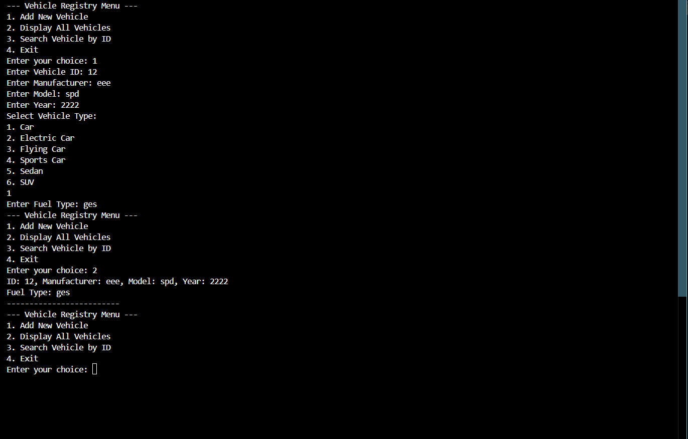

<h1 align="center">Vehicle Registry System using C++</h1>
 

<h3 align="center">Develop a Vehicle Registry System using C++ that demonstrates all types of inheritance and
encapsulation. The system will allow users to manage a registry of different types of vehicles.</h3>
 

<h1 align="center">Vehicle Registry System</h1>
 

 

>

